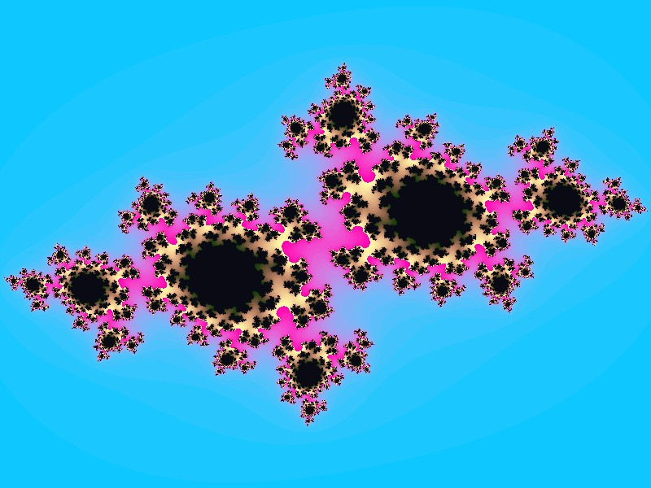
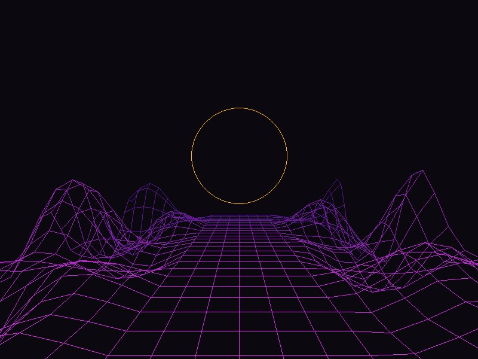
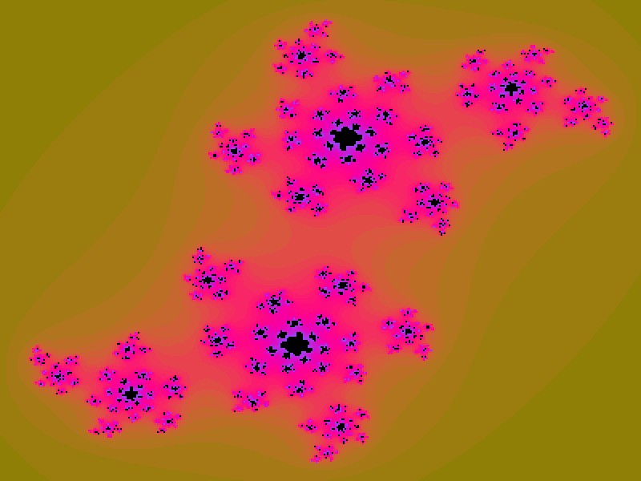
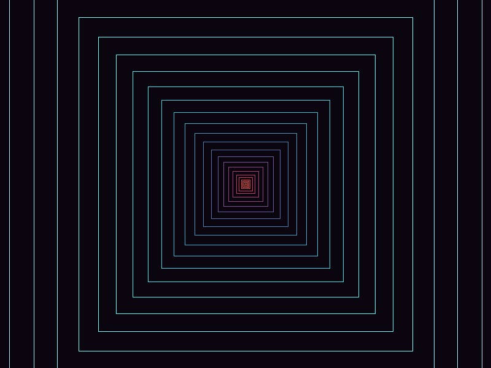
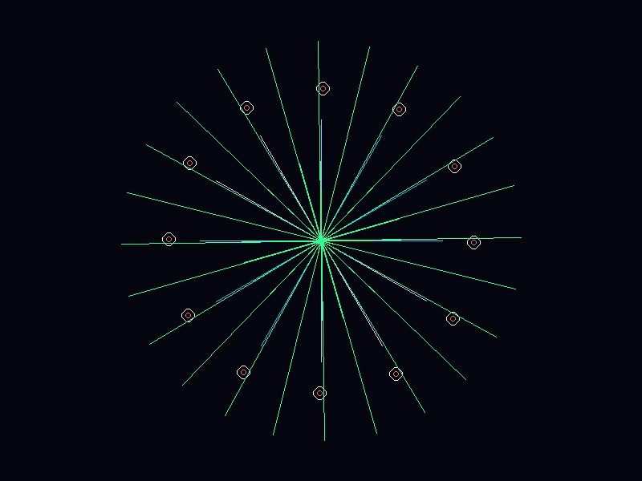
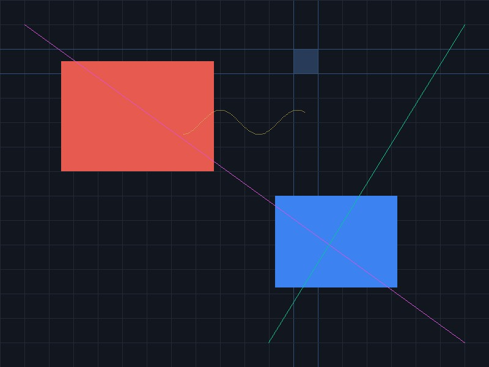
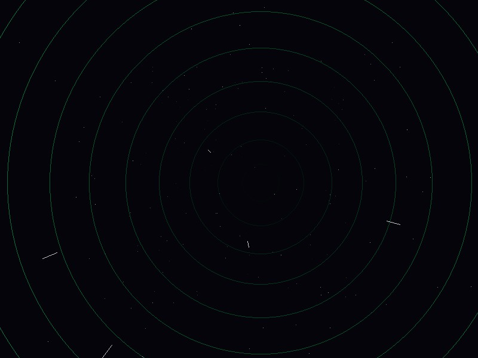
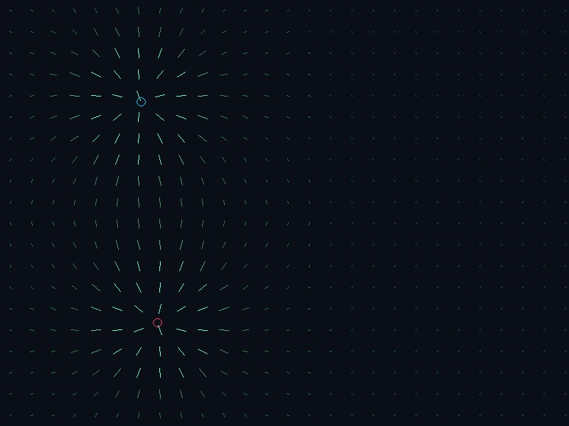
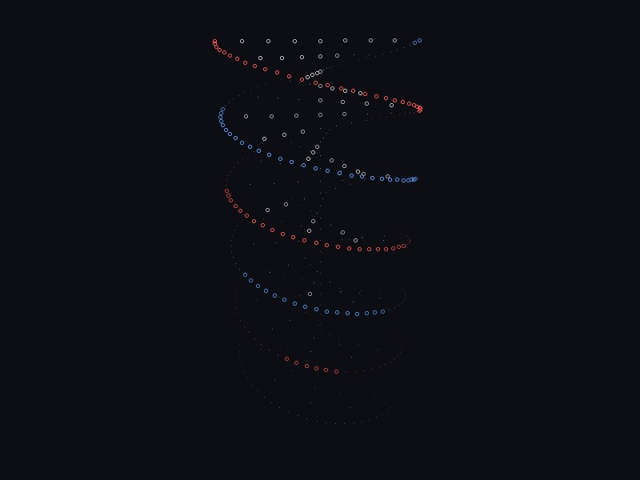
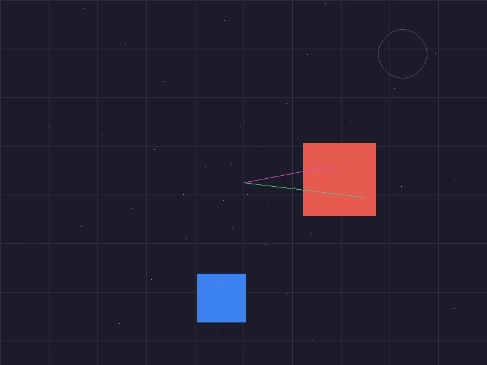

# 🧰 Daily C++ Modules

A curated collection of production-ready, lightweight, and zero-overhead C++ micro-modules for everyday development. 

Instead of pulling in heavy, monolithic libraries for basic tasks, developers can simply copy a single folder from this repository and drop it straight into their project.

### 🐧 Fully Supported Platforms:
* **Windows** — Native Win32 / WinNT API & WGL graphics contexts.
* **Linux** — Pure X11 / Xlib sockets & GLX context mapping (No heavy desktop environments toolkits needed).

---

## 🎯 The Philosophy

* **Zero Boilerplate:** No heavy configurations, no external cascade dependencies. Just pure C++23.
* **Plug & Play:** Designed natively with modern CMake (`FILE_SET CXX_MODULES`). Copy-paste and use via `add_subdirectory`.
* **Modern Standards:** Built from the ground up using modern features (`import std;`, `std::expected`, `std::ranges`, `std::println`) for absolute compile-time safety and performance.
* **Bite-Sized:** Each directory solves exactly *one* specific domain problem beautifully and minimally.

---

## 🚀 High-Reliability Mission-Critical Build Configuration

This project supports a compilation mode with the maximum possible level of static analysis and runtime safety guards, standard for aerospace and mission-critical software. It aims to completely eliminate undefined behavior (UB), implicit type narrowings, and memory safety issues. 

Every single compiler warning is strictly treated as a hard compilation error.

### Applied Compiler Flags & Security Guards

*   **`-Werror`** – Zero tolerance for warnings; turns every compiler warning into a build-stopping error.
*   **`-Wall -Wextra -Wpedantic`** – Enables the core, extra, and strict ISO C++ standard conformance diagnostics.
*   **`-Wconversion -Wsign-conversion`** – Audits all implicit type narrowing and sign changes (e.g., mixing `int` and `unsigned`).
*   **`-Weffc++`** – Enforces Scott Meyers' Effective C++ guidelines (proper member initialization, safe destructors).
*   **`-Wshadow -Wlogical-op -Wstrict-overflow=5`** – Detects variable shadowing, suspicious logical conditions, and dangerous compiler assumptions about overflows.
*   **`-Wold-style-cast -Wzero-as-null-pointer-constant`** – Completely bans old C-style casts and raw `0` pointers, enforcing type-safe C++ casts (`static_cast`, `reinterpret_cast`) and `nullptr`.
*   **`-Wcast-align -Wcast-qual -Wformat=2`** – Checks pointer alignment safety, const correctness modifications, and strictly validates string formatting arguments.
*   **`-Wmissing-declarations`** – Ensures every exported or global function has a proper forward declaration to maintain interface integrity.
*   **`-fstack-protector-strong`** – Injects defensive "canaries" into the stack to crash the application instantly if a buffer overflow is attempted.
*   **`-D_GLIBCXX_ASSERTIONS`** – Forces runtime bounds checking on standard STL containers (`std::vector::operator[]`, `std::string`).
*   **`-DCMAKE_BUILD_TYPE=RelWithDebInfo`** – Builds with stable `-O2` optimizations while preserving full debugging symbols for precise crash dump analysis.

---

## 📁 Repository Structure

Every tool is completely isolated in its own directory:

```text
.
├── CMakeLists.txt         # Global build configuration (runs tests for all modules)
└── glm_lite/              # A plug-and-play micro-module example
    ├── CMakeLists.txt     # Local CMake target definition
    ├── glm_lite.ixx       # C++23 module interface
    └── main.cpp           # Usage examples / Integration tests
```

---

## 🚀 Quick Integration Guide

To use any module (e.g., `glm_lite`) in your codebase:

1. **Copy** the module's directory into your project.
2. Link it in your **`CMakeLists.txt`** (requires CMake 3.30+ for robust standard library modules support):

```cmake
cmake_minimum_required(VERSION 3.30)
project(YourApp LANGUAGES CXX)

# Include the copied module
add_subdirectory(glm_lite)

add_executable(app main.cpp)
target_link_libraries(app PRIVATE glm_lite)
```

3. **Import** it directly in your source code:
```cpp
import glm_lite;
import std;

int main() {
    glm::vec3 velocity{0.0f, 9.8f, 0.0f};
    std::println("Vector initialized at gravity acceleration: [{}, {}, {}]", velocity.x, velocity.y, velocity.z);
}
```

---

## Prerequisites

* **CMake 3.30+** (Strictly required for stable C++23 Standard Library Modules support via `import std;`)
* **Compilers:** MSVC 2026+ (Windows) or GCC 15.1+ (Linux/MinGW) / Clang 19+

## 🛠️ Building & Testing Locally

To build the entire ecosystem and run validation tests for all modules simultaneously, ensure you have a compiler with robust C++23 module support and **Ninja**.

```bash
git clone https://github.com
cd daily-cpp-modules

# Configure using the Ninja generator (highly recommended for C++ Modules)
cmake -B build -G Ninja

# Build all modules and verification drivers
cmake --build build
```

---

## 🗂️ Available Micro-Modules

| Module | Purpose / Domain | Key C++ Features Used |
|:---|:---|:---|
| **[`WinLite`](./Modules/WinLite)** | Lightweight Windowing & Event loop for **Windows (WinNT)** and **Linux (Xlib)**. | Native OS Display Handles, C++23 Unions |
| **[`PixelPainter`](./Modules/PixelPainter)** | Software rasterizer canvas for custom 2D primitives. | `std::span`, Bresenham's loops, `constexpr` |
| **[`PixelCopier`](./Modules/PixelCopier)** | Real-time texture blitting, clipping, and sprite scaling. | Fixed-Point `16.16` bit precision mapping, `std::span` |
| **[`GlmLite`](./Modules/GlmLite)** | Ultra-lightweight vector math, 4x4 matrices & matrix transformations. | Column-major layout, `constexpr`, `std::sqrt/sin/cos` |
| **[`OpenGL`](./Modules/OpenGL)** | Explicit OpenGL extension loader matrix (Modern **GLAD replacement**). | Dynamic symbol resolution (`GetProcAddress`), `import std;` |
| **[`BmpLoader`](./Modules/BmpLoader)** | Exception-free 24/32-bit BMP image loader. | Monadic `std::expected`, layout padding checks |
| **[`TgaLoader`](./Modules/TgaLoader)** | Exception-free 24/32-bit TGA true-color texture loader. | Monadic `std::expected`, descriptor orientation flags |
| **[`BmpSaver`](./Modules/BmpSaver)** | 24/32-bit BMP image exporter and canvas dumper. | Monadic `std::expected`, safe memory serialization |
| **[`HighResTimer`](./Modules/HighResTimer)** | Stopwatch performance timer for profiling loops. | Monadic clocks (`std::chrono::high_resolution_clock`) |
| **[`FpsCounter`](./Modules/FpsCounter)** | Non-drifting real-time frames-per-second indicator. | Steady non-drifting accumulator intervals |

---

## 🤝 Contributing

Have a tiny C++23 utility module that you use in every project? Feel free to open a Pull Request! Please ensure your module is fully self-contained, provides a `CMakeLists.txt` with `FILE_SET CXX_MODULES`, and includes a clean automated testing driver.

## 📄 License
This project is open-source software licensed under the **Boost Software License - Version 1.0 - August 17th, 2003**. Use these modules freely in personal, educational, or commercial projects.

---

## 🖼️ Gallery & Demos

Here is the `RenderPixels` showcase running live, combining both **WinLite** (window management) and **SoftwareRender** (fixed-point canvas primitives, Bresenham lines, and clipping math) modules:

| | | |
| :---: | :---: | :---: |
|  |  |  |
|  |  |  |
|  |  |  |
|  |  |  |
|  |  |  |
|  |  |
